## 📐 Architecture Overview

```mermaid
graph TB
    subgraph DataSpace ["Data Space Layer (Real World)"]
        DS["Data Space Assets<br/>(Datasets, Files)"]
        AP["Applications/Services<br/>(Algos, Models)"]
    end

    subgraph Semantic ["Semantic Layer (Ontology)"]
        subgraph CRED ["CRED / UNE 0087 Compliance (v1.2.1)"]
            CAT["dcat:Catalog<br/>(Federated Registry)"]
            SRV["dcat:DataService<br/>(Access Interface)"]
            POL["odrl:Policy / Offer<br/>(Usage Rights)"]
            AGN["foaf:Agent<br/>(Publisher/Provider)"]
        end

        subgraph Compliance ["IDSA Alignment (Base)"]
            DCAT["dcat:Dataset<br/>(Discovery)"]
            DR_IDSA["ids:DataResource"]
            DA_IDSA["ids:DataApp"]
        end

        subgraph AgoraOWL ["AgoraOWL (Deep Semantics)"]
            DA[":DataAsset<br/>(Supply)"]
            Apps[":SmartDataApp Types<br/>(Demand)"]

            subgraph Matchmaking ["v1.2.1 Symmetric Matchmaking"]
                Spec[":DataSpecification<br/>(Atomic Variable)"]
                Prof[":DataProfile<br/>(Grouping)"]
                Mapping[":FieldMapping<br/>(Bridge Layer)"]
                InputProf[":InputProfile<br/>(App Input Port)"]
                OutputProf[":OutputProfile<br/>(App Output Port)"]
                Cons[":DataConstraint<br/>(Thresholds)"]
            end

            subgraph Metadata ["Distribution Metadata"]
                Res["Technical Resolutions / CRS"]
            end

            subgraph Meaning ["Semantic Core"]
                OP[":ObservableProperty<br/>(Meaning)"]
                FOI[":FeatureOfInterest<br/>(Subject)"]
            end

            Metric[":Metric (v1.2.1)"]
            Prov_O[":Provenance<br/>(PROV-O)"]
            Repr[":DataRepresentation<br/>(Distribution)"]
        end

        subgraph BIGOWL ["BIGOWL (Workflow)"]
            WF["bigwf:Workflow"]
            Comp["bigwf:Component"]
        end
    end

    %% Relationships
    DS -->|"described as"| DR_IDSA
    DR_IDSA -->|"specialized by"| DA
    DA -.->|"mapped to"| DCAT
    CAT -- "dcat:dataset" --> DCAT
    CAT -- "dcat:service" --> SRV
    SRV -- "dcat:servesDataset" --> DCAT

    DCAT -- "odrl:hasPolicy" --> POL
    DCAT -- "dct:publisher" --> AGN

    AP -->|"described as"| DA_IDSA
    DA_IDSA -->|"specialized by"| Apps

    DA -- "hasFeatureOfInterest" --> FOI

    DA -- "dcat:distribution" --> Repr
    Repr -- "hasProfile" --> Prof
    Prof -- "hasDataSpecification" --> Spec
    Repr -- "hasFieldMapping" --> Mapping
    Mapping -- "mapsToSpecification" --> Spec
    Mapping -- "mapsField" --> Field["Physical Field"]
    Mapping -- "hasUnit / hasDataType" --> U["Unit / Type"]

    Apps -- "hasInputProfile" --> InputProf
    InputProf -- "hasDataSpecification" --> Spec
    InputProf -- "hasConstraint" --> Cons

    Apps -- "hasOutputProfile" --> OutputProf
    OutputProf -- "hasDataSpecification" --> Spec

    Spec -- "hasFeatureOfInterest" --> FOI
    Spec -- "hasObservableProperty" --> OP

    Repr -- "technicalMetadata" --> Res

    Mapping -- "hasMetric" --> Metric
    Metric -- "hasMetricStandard" --> QUDT["QUDT / SKOS"]
    Metric -- "measuresProperty" --> OP

    DA -.->|"prov:wasGeneratedBy"| Apps
    DA -.->|"assetWasDerivedFrom"| DA

    Apps -- "implementsComponent" --> Comp
    Comp -->|"part of"| WF

    %% Styling
    classDef space fill:#e3f2fd,stroke:#1565c0,stroke-width:2px
    classDef idsa fill:#fce4ec,stroke:#c2185b,stroke-width:2px
    classDef agoraowl fill:#e8f5e9,stroke:#2e7d32,stroke-width:2px
    classDef bigowl fill:#fffde7,stroke:#fbc02d,stroke-width:2px
    classDef cred fill:#f3e5f5,stroke:#7b1fa2,stroke-width:2.5px
    classDef core fill:#ffffff,stroke:#2e7d32,stroke-width:1px,stroke-dasharray: 5 5

    class DS,AP space
    class DR_IDSA,DA_IDSA idsa
    class DA,Repr,Apps,Spec,Prof,Mapping,InputProf,Cons,OP,FOI,Metric,Prov_O agoraowl
    class WF,Comp bigowl
    class CAT,SRV,POL,AGN cred
    class Matchmaking,Metadata,Meaning core
```



## 🖼 Architecture diagram


_Figure 1: High-level architecture showing how AgoraOWL maps IDSA concepts to BIGOWL components, all wrapped within a CRED / DCAT-AP 3.0 compliant cataloguing layer._

### 🔄 Semantic Matchmaking Flow (v1.2.1 Symmetric)


_Figure 2: Conceptual flow showing the interaction between the Semantic, Dataset, Quality, and App layers._

### 🧬 Class Diagram (v1.2.1)


_Figure 3: Core classes and relationships in the version 1.2.1 symmetric profile architecture._

### Architecture overview

The figure above shows how AgoraOWL connects real-world data-space assets with semantic models from IDSA, BIGOWL, and the **CRED (UNE 0087:2025)** recommendations.

### CRED / DCAT-AP 3.0 Alignment (v1.2.1)

As of version 1.2.1, AgoraOWL provides an alignment layer for the **Spanish Data Office (CRED)**, the **UNE 0087:2025** standard, and **DCAT-AP 3.0**. Conformance to a specific application profile must be established by running the corresponding official SHACL suite.

- **`dcat:Catalog`**: Acts as the root container for all assets and services within an EDAAn data space instance.
- **`dcat:DataService`**: Describes the technical access points (APIs) to the data, effectively wrapping `ids:DataApp` or smart data apps.
- **`odrl:Policy` / `odrl:Offer`**: Provides a standardized way to describe usage conditions, rights, and prohibitions, replacing generic text with machine-readable rules.
- **`foaf:Agent`**: Standardizes the representation of publishers, providers, and consumers.
- **ADMS Metadata**: Uses the Asset Description Metadata Schema for versioning (`adms:versionNotes`) and status tracking (`adms:status`).

This layer provides the "Discovery" and "Governance" metadata, while AgoraOWL's core provides the "Deep Semantics" required for automated processing and quality assessment.

### Alignment with the IDSA Information Model

In the IDSA model, **`ids:Resource`** is the generic notion of an asset in the data space. It is refined into:

- **`ids:DataResource`**, used to describe data assets (datasets, files, etc.).
- **`ids:DataApp`**, used to describe data-processing applications or services.

In AgoraOWL, these classes are specialised to capture more domain-specific concepts:

- **`DataAsset`** is aligned with and specialises `ids:DataResource` (supply side).
- **Smart data app types** specialise `ids:DataApp` (demand side).

### Matchmaking Layer: Atomic Specifications and Field Mappings (v1.2.1)

In version 1.2.1, AgoraOWL consolidates the decoupled architecture that separates semantic meaning from technical schema to enable extreme reusability and symmetric app discovery.

#### 1. Atomic Data Specifications (`DataSpecification`)

Specifications are now **pure semantic units** that define WHAT is being measured (e.g., "NDVI for Olives", "Soil Moisture"). They contain:

- `:hasFeatureOfInterest` (generic category, e.g., Olives).
- `:hasObservableProperty` (semantic concept, e.g., NDVI).
  They do **NOT** contain column names, units, or metrics.

#### 2. Data Profiles (`DataProfile` / Dataset layer)

This layer conceptually groups multiple semantic specifications at the distribution level. It represents the "what is inside this dataset as a whole" without referring to technical columns:

- `:hasDataSpecification`: Points to the reusable atomic specification.

#### 3. Field Mappings (`FieldMapping`)

This bridge layer connects an atomic specification to a physical file's specific field:

- `:mapsToSpecification`: Points to the reusable atomic specification.
- `:mapsField`: Specifies the column name or field (e.g., "ndvi_column").
- `:hasUnit`: Defines the unit of measure (QUDT) used in this specific distribution.
- `:hasDataType`: Defines the XSD data type.
- `:hasObservationMetric`: Defines the aggregation or statistical metric (e.g., DailyAverage).
- `:hasMetric`: Links technical quality metrics (e.g., Accuracy).

#### 4. DataApp Profiles (`InputProfile` / `OutputProfile`)

Apps define their ports through specialized profiles:

- `InputProfile`: Specifies what data an app needs (Demand).
- `OutputProfile`: Specifies what data an app produces (Supply).
- `:hasDataSpecification`: Specifies the needed/produced atomic variables.
- `:hasConstraint`: Defines requirements for units, data types, or thresholds (e.g., `requiresDataType: xsd:float`, `requiresUnit: Celsius`).

This enables high-precision matchmaking where an app's semantic and technical needs are compared against the distribution's profiles and mappings.

#### 5. Automatic Discovery (Matchmaking)

By reusing the same semantic variable (`DataSpecification`) across supply (Datasets) and demand (Apps), the system can perform automated discovery:

- **Datasets** declare what specifications they provide via `FieldMapping`.
- **Apps** specify what specifications they require via `InputProfile`.
- Discovery is performed by comparing the URIs of the required and provided atomic specifications.

---

#### 6. Matchmaking Specification (Normative Steps)

To ensure full semantic interoperability, agents MUST follow these validation steps.

> **Changed in v1.3.0.** The v1.2.x table referenced two things that did not exist:
> a property named `expectedValue` (the ontology declares `:constraintValue`) and a
> required `dct:format` for which no property existed at all. It also left the most
> important case undefined: what happens when a constraint **cannot be evaluated**
> because the candidate publishes no corresponding evidence. AgoraOWL's own reference
> example hit exactly that case - `SmartIrrigatorApp` requires `Accuracy >= 0.90` and
> the only matching `FieldMapping` in `eo-instances.ttl` carries no `:Metric` at all -
> so two conformant implementations could return opposite answers for the same pair.
> `:constraintEnforcement`, `:requiresFormat` and `:requiresMediaType` close the gap.

| Step | Rule | Validation mechanism |
| :--- | :--- | :--- |
| **1. Semantic match** | The app's `InputProfile` and the candidate's `FieldMapping` MUST share the same `DataSpecification` IRI. | SPARQL over the catalogue graph |
| **2. Data type** | If the constraint declares `:requiresDataType`, it MUST equal the mapping's `:hasDataType`. | Exact IRI match (XSD datatype IRIs) |
| **3. Unit** | If the constraint declares `:requiresUnit`, it MUST equal the mapping's `:hasUnit`. | Exact IRI match. Units MUST use the canonical `http://qudt.org/vocab/unit/` namespace; the `www.` variant is a different IRI and silently breaks every match. |
| **4. Observation metric** | If the constraint declares `:requiresMetric`, it MUST match the mapping's `:hasObservationMetric`. | SKOS `broader` / exact match |
| **5. Quality threshold** | If the constraint declares `:constraintValue`, it MUST also declare `:constraintOperator`, and the comparison is made against the `:metricValue` of the mapping's `:Metric` whose `:metricType` equals `:constraintMetricType`. Values of `:Accuracy`, `:Completeness`, `:Uniqueness`, `:Consistency` and `:Duplication` are on the closed unit interval `[0,1]`. | SHACL + SPARQL |
| **6. Format** | If the constraint declares `:requiresFormat` or `:requiresMediaType`, it MUST match `dct:format` / `dcat:mediaType` of the candidate `Distribution`. | Exact IRI match |

##### 6.1 Unevaluable constraints (normative)

A constraint is **unevaluable** against a candidate when the candidate publishes no
evidence for it - typically a quality threshold with no corresponding `:Metric`, or a
`:requiresMetric` with no `:hasObservationMetric`.

* A constraint carrying `:constraintEnforcement :Mandatory` that is unevaluable MUST
  cause the match to be **rejected**.
* A constraint carrying `:constraintEnforcement :Preferred`, or **no**
  `:constraintEnforcement` at all, that is unevaluable MUST **not** reject the match,
  but the candidate MUST be ranked below any candidate that satisfies it explicitly.

The default is `:Preferred`. This is a deliberate open-world reading: absence of a
published metric is absence of evidence, not evidence of failure. Publishers who need
the stricter reading declare it per constraint.

##### 6.2 Scale (normative)

`:metricValue` for any `:UnitIntervalMetric` MUST be a decimal in `[0,1]`. Connectors
that compute these figures as percentages MUST divide by 100 before publishing.
Comparing `93` against a `0.90` threshold succeeds silently and is a known source of
false matches; `shapes/edc-connector-shapes.ttl` rejects it.

---

## 🏛 Strategic Design Principles

This model follows three core principles for resilient data space annotation:

### 1. Reusable Semantic Variables

`DataSpecification` represents a scientific variable (e.g., _SoilMoisture_, _AirTemperature_). These are schema-agnostic and can be reused by hundreds of datasets, making them the "common language" of the data space.

### 2. Profiles as Grouping Units

`DataProfile` (and its specialisations `InputProfile` / `OutputProfile`) allows grouping multiple variables into a single logical unit. An app doesn't just need "data"; it needs a specific _profile_ of variables to function.

### 3. Separation of Concerns

By separating the **Meaning** (Specification), **Structure** (FieldMapping), and **Requirement** (Constraint), we ensure that an application remains decoupled from the physical format (CSV, JSON, SQL) of the data asset.

---

> **Domain-Specific Catalogs: SIEX (FEGA)**
> Although AgoraOWL follows a "Zero-Local" vocabulary policy, we include a strategic exception for the **[SIEX (Spain)](https://www3.sede.fega.gob.es/bdcsixpor/catalogos)** catalogs. These codes are essential for the Spanish agricultural sector and government aid (CAP/PAC). Since no official RDF version exists, we curate them locally via automated CSV-to-SKOS transformation to support the [EDAAn Data Space](https://agoraowl.agora-datalab.eu/).

### Workflow perspective with BIGOWL

The **BIGOWL** part of the diagram introduces the workflow view:

- **`Workflow`** represents an analytical or data-processing pipeline.
- **`Component`** represents a step, operator, or module within that workflow.

Smart data apps are linked to this workflow layer by:

- **Smart data app types** **implementComponent**, meaning they realise or execute specific BIGOWL components.
- Components are **part of** a workflow, placing the app in the context of a larger analytical or processing chain.

This alignment allows:

- AgoraOWL to describe assets and apps at the data-space level.
- BIGOWL to describe how those apps participate in concrete analytical workflows.

Together, these layers provide a coherent view from real assets and services, through their semantic descriptions, to their role in executable workflows.

---

## 🔒 OWL 2 DL Conformance & Third-Party Alignment (v1.3.0)

Up to v1.2.1, `AgoraOWL.ttl` asserted ~110 `rdfs:domain` / `rdfs:range` axioms over
properties it does not own — DCAT, DCMI Terms, ODRL, FOAF. Sixteen of them
contradicted the source vocabulary (e.g. `odrl:permission`, `odrl:prohibition` and
`odrl:obligation` all shared range `odrl:Rule`, collapsing a distinction policy
engines depend on), and the ontology itself failed the OWL 2 DL profile (13
violations: annotation/data-property punning on `dct:modified`, and `rdfs:Resource`
/ `rdfs:Datatype` used as classes).

**As of v1.3.0:**

- The core ontology asserts **no logical axiom** over a third-party property.
  `robot validate-profile --profile DL` passes with zero violations.
- Corrected third-party axioms live in `alignment.ttl`, an **optional, opt-in**
  module — not imported by the core, so merging AgoraOWL with the real DCAT / ODRL
  / FOAF graphs no longer changes what those vocabularies mean.
- The OWL layer gained discriminating power it never had: `owl:AllDisjointClasses`
  across the structural layers (`DataSpecification`, `FieldMapping`, `DataProfile`,
  `DataConstraint`, `Metric`) and across `{DataAsset, DataApp}`, plus ten
  `owl:FunctionalProperty` declarations. Up to v1.2.1 there was not a single
  disjointness or functional axiom, so a reasoner could not detect a modelling
  error in any input graph — `robot reason` was a smoke test that could not fail.

SHACL remains the normative validation layer; OWL reasoning is a schema-coherence
check, not a data-validation mechanism. See `src/1.3.0/README.md` for the full
list of corrected axioms and `src/1.3.0/examples/negative/` for the fixtures that
now make the reasoner and the SHACL shapes fail on purpose.

---

## 🔌 Eclipse EDC Connector Profile (v1.3.0)

An asset stored in an [Eclipse EDC](https://projects.eclipse.org/projects/technology.edc)
connector and the `dcat:Dataset` a partner receives over the Dataspace Protocol are
**not the same graph**: EDC lifts every `edc:properties` entry to a direct
predicate of the dataset node it publishes. Validating the Management API
representation therefore says nothing about what partners actually see.

- **`context.jsonld`**: the JSON-LD context AgoraOWL publishes, consumed by EDC
  0.18+ via `edc.dataspace.profiles.*.jsonld.context.urls` to compact outgoing DSP
  messages.
- **`shapes/edc-connector-shapes.ttl`**: a self-contained SHACL profile that
  validates the graph a connector actually publishes — including a guard against
  copying `FieldMapping`/`DataSpecification` properties up to the dataset node for
  search faceting, which types the dataset as both at once and violates the new
  disjointness axioms.
- **`scripts/edc_catalog_projection.py`**: projects a Management API asset payload
  onto the DSP catalogue graph, reproducing EDC's loss of `@language`/`@type` on
  scalar asset properties (nested node objects survive intact).

See `src/1.3.0/examples/edc/` for a reference payload and its projection, and
`src/1.3.0/README.md` for how this was verified against Eclipse EDC Connector
v0.18.0.

---

## 📁 Repository Structure & Branching Model

This repository uses a `feat/*` -> `main` -> `gh-pages` git flow, automated by
[release-please](https://github.com/googleapis/release-please) for versioning
and changelog generation.

> [!NOTE]
> An earlier revision of this document described a `dev` -> `main` -> `gh-pages`
> flow with a mandatory `dev` staging branch. That branch exists but has been
> stale since before the EDAAnOWL → AgoraOWL rename and is not part of the live
> workflow — every recent release (v0.7.0 through v1.2.1) merged a feature
> branch directly into `main` via Pull Request. The description below matches
> what actually happens.

> [!CAUTION]
> **`gh-pages` branch is AUTO-GENERATED. DO NOT EDIT MANUALLY.**

1. **Feature branches** (e.g. `feat/v1.3.0-...`, `fix/...`): all new work,
   including new ontology versions. Commit messages MUST follow
   [Conventional Commits](https://www.conventionalcommits.org/) — release-please
   parses them to decide the next version number and to write the changelog.
   A commit under `src/<version>/` for a version folder that does not yet exist
   on `main` is what introduces a new ontology release; bumping requires at
   least one `feat:` commit (minor) or a `!`/`BREAKING CHANGE:` marker (major).

2. **Pull Request into `main`**: opened from the feature branch, targeting
   `main` directly. `.github/workflows/validate.yml` runs RDF syntax, the OWL 2
   DL profile, SHACL, and the conformance suite (`scripts/conformance_suite.py`)
   on every PR that touches `src/` or `scripts/`.

3. **Merge into `main`** (a real merge commit, not squash — release-please
   needs each individual conventional commit, not one collapsed PR commit):
   `main` always represents the most recently merged state. The push triggers
   `.github/workflows/release-please.yml`, which opens or updates a
   `chore(main): release X.Y.Z` Pull Request carrying the computed version bump
   and the generated `CHANGELOG.md` entry — it does **not** publish anything by
   itself.

   - **Structure of `main`**:
     - `/src/`
       - `1.3.0/` (Latest stable ontology and vocabularies)
       - `1.2.1/`, `1.2.0/`, ... (Previously released versions, kept immutable)
     - `/.github/workflows/` (The CI/CD workflows)

4. **Merging the release-please PR** is what actually cuts the release: it
   bumps `.github/.release-please-manifest.json`, updates `CHANGELOG.md`,
   creates the git tag (e.g. `v1.3.0`), and publishes a GitHub Release. Only
   *this* merge is irreversible in the way a public release is — review its
   generated CHANGELOG before merging it.

5. **`gh-pages` branch**: the GitHub Release (step 4) triggers
   `.github/workflows/deploy-docs.yml` (`on: release: types: [created]`), which
   builds the Widoco documentation, the vocabulary docs
   (`scripts/generate_vocab_docs.py`), and publishes everything to `gh-pages` —
   the branch served at <https://khaosresearch.github.io/AgoraOWL/>.

   - **Structure**:
     - `/latest/` (A mirror of the most recent version)
     - `/1.3.0/`, `/1.2.1/`, `/1.2.0/`, ... (One folder per released version)
     - `.nojekyll` (Disables Jekyll on GitHub Pages)

---

## 🧪 Local Validation (Docker-based)

This repository includes a Docker-based local validation environment to check the ontology and its vocabularies _before_ creating a new release.

The validation pipeline performs three main checks:

1. **RDF Syntax Validation**
   - Script: `scripts/check_rdf.py`
   - Runs inside a Docker container with Python and `rdflib`.
   - It automatically detects the **latest version folder** under `src/` (e.g. `src/0.0.1/`) and parses all `*.ttl` files in:
     - `src/<version>/`
     - `src/<version>/vocabularies/`
     - `src/<version>/examples/`
     - `src/<version>/shapes/`
   - If any file is not well-formed RDF, the script fails with a non-zero exit code and prints a summary.

2. **SHACL Validation (pySHACL)**
   - Tool: [`pyshacl`](https://github.com/RDFLib/pySHACL) (installed in the Docker image).
   - Validates:
     - Main ontology: `src/<version>/AgoraOWL.ttl`
     - Against shapes: `src/<version>/shapes/edaan-shapes.ttl` and the relevant compliance shapes
     - With test data: `src/<version>/examples/test-consistency.ttl`
   - The validation runs with:
     - RDFS inference (`-i rdfs`)
     - Meta-SHACL checks (`-m`)
   - The process prints a SHACL validation report and fails if `Conforms: False`.

3. **OWL Consistency Check (ROBOT + ELK)**
   - Tool: [`ROBOT`](http://robot.obolibrary.org/) with ELK reasoner
   - Validates:
     - Main ontology: `src/<version>/AgoraOWL.ttl`
     - Test instances: `src/<version>/examples/test-consistency.ttl`
   - Performs:
     - Consistency checking
     - Classification
     - Instance realization
   - If reasoning fails, the validation script reports an error.

### Docker Image

All local validations run in the same Docker image, defined by the root-level `Dockerfile`:

- Base image: `eclipse-temurin:17-jdk-jammy` (JDK 17)
- Installs:
  - `python3`, `python3-pip`
  - Python packages: `rdflib`, `pyshacl`
  - `wget` to download `robot.jar`
- Downloads ROBOT to:
  - `/opt/robot/robot.jar`
- Sets the default working directory to:
  - `/app`, where the repository is mounted at runtime (`-v <repo>:/app`).

### Scripts & Usage

Two convenience scripts are provided to run the full local validation pipeline:

- **Windows**: `scripts/local-validate.bat`
- **Linux/macOS**: `scripts/local-validate.sh`

Both scripts:

1. Build (or rebuild) the Docker image:

   ```bash
   docker build -t agoraowl-validator -f Dockerfile .
   ```

2. Detect the latest version under src/ (e.g. src/0.0.1/).

3. Run:

- `scripts/check_rdf.py` (RDF syntax validation)
- `pyshacl` (SHACL validation)
- `ROBOT reason` (OWL consistency check)

If any step fails, the script prints an error message and exits with a non-zero code.

### How to run

From the repository root:

- On Windows (PowerShell or CMD):

  ```bash
  .\scripts\local-validate.bat
  ```

- On Linux/macOS:

  ```bash
  chmod +x scripts/local-validate.sh
  ./scripts/local-validate.sh
  ```

> [!NOTE]
> These scripts are intended to be used locally by developers before creating a new release, and can also be integrated into CI pipelines if desired.

---

## 🔗 Resolvability (PID)

This repository manages the _source code_. The Persistent Identifiers (PIDs) (e.g., `https://w3id.org/AgoraOWL/...`) are resolved by the `.htaccess` file located in the [w3id.org repository](https://github.com/perma-id/w3id.org/tree/master/ids/AgoraOWL).

That `.htaccess` file points all requests to the documentation and files automatically built and published by our CI/CD workflow to the `gh-pages` branch, which is hosted at:

**`https://khaosresearch.github.io/AgoraOWL/`**
